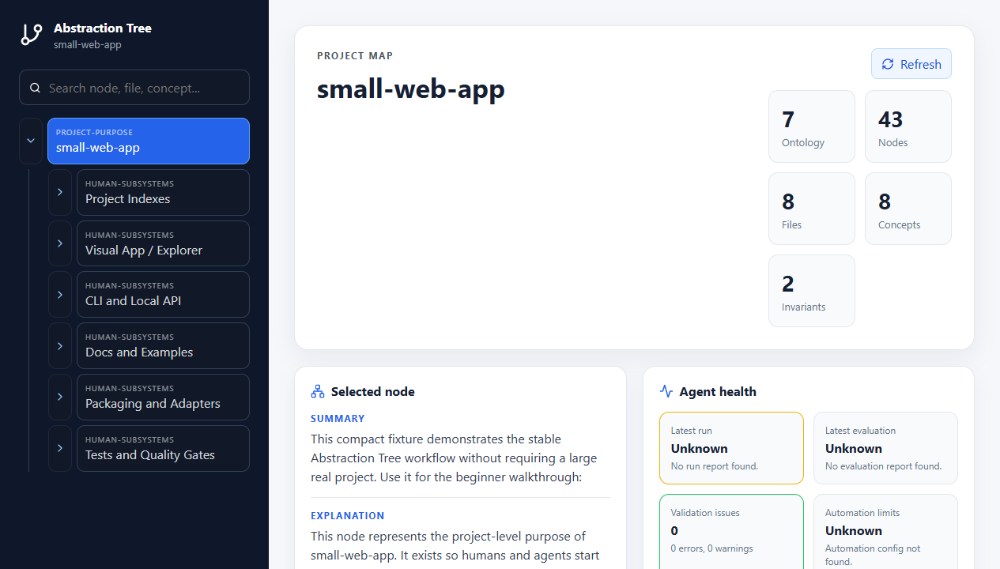
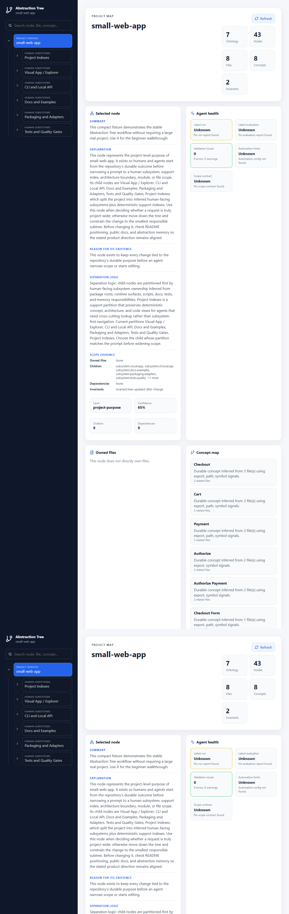
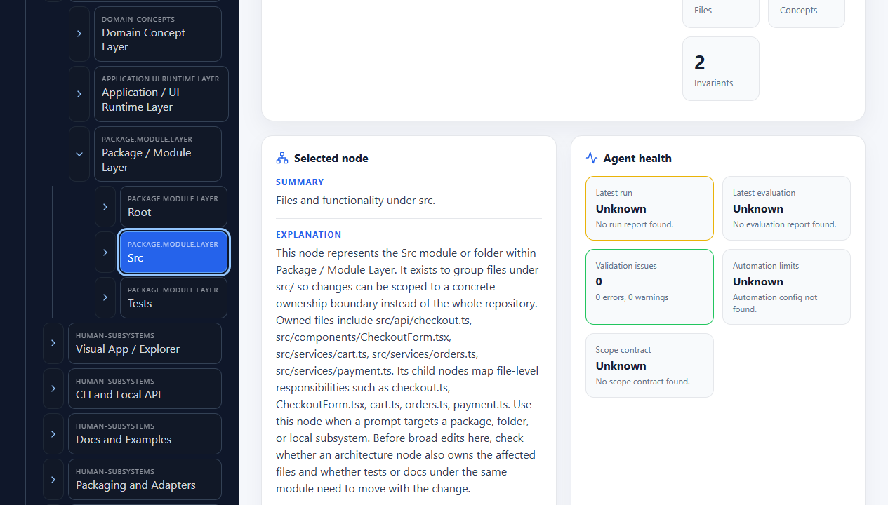
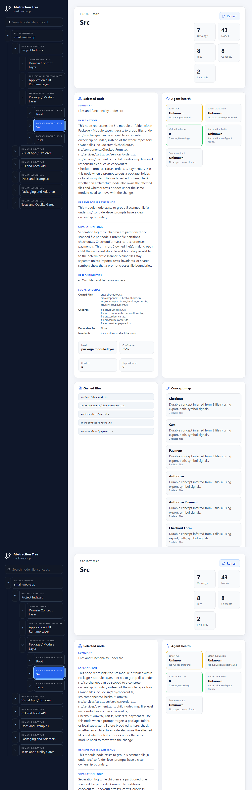
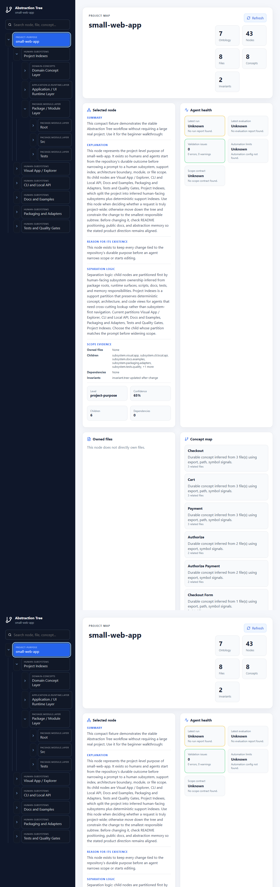

# Visual Demo

> Audience: New users and evaluators
> Status: Stable app workflow with real local screenshots
> Read after: GETTING_STARTED.md

The visual app shows the target project's generated `.abstraction-tree/` memory. It should show this repository's dogfooding memory only when this repository is the target project.

## Launch the Demo

```bash
npm install
npm run build
npm run atree -- init --with-app --project examples/small-web-app
npm run atree -- scan --project examples/small-web-app
npm run atree -- serve --project examples/small-web-app --open
```

## What the App Shows

- The abstraction hierarchy as an expandable tree.
- A selected node summary, explanation, reason for existence, and separation logic.
- Files owned by the selected node.
- Concepts and invariants inferred from the target project.
- Recent semantic changes and validation/evaluation health.

## Walkthrough

1. Open the root project node and read its explanation.
2. Expand the architecture branch to see the generated API, UI, dataflow, and package-distribution surfaces.
3. Select a checkout-related node and compare its owned files with the checkout source files.
4. Review concepts such as checkout, cart, payment, and order.
5. Run `atree validate` after changing the example and refresh the app to see drift or health updates.

## Screenshots

The screenshots below were captured from the local app against `examples/small-web-app`.

### Tree Hierarchy

The left panel shows an expandable abstraction tree generated from the target project's own `.abstraction-tree/` memory.



### Selected Node Explanation

The selected-node panel starts with what the node represents, then shows the richer explanation, reason for existence, and child separation logic.



### File Ownership

Folder and file nodes connect the abstraction tree back to concrete source files so agents can pick a smaller edit boundary.



### Concepts And Invariants

The app exposes inferred concepts and invariants alongside the tree so humans can see cross-cutting project ideas and drift risks.



### Health, Context, And Drift

The app shows validation health and available agent-facing memory signals. This is evidence for review, not a guarantee that a change is correct.



If the UI changes, refresh screenshots intentionally from a real `atree serve` session. Do not commit mock or generated marketing screenshots.
